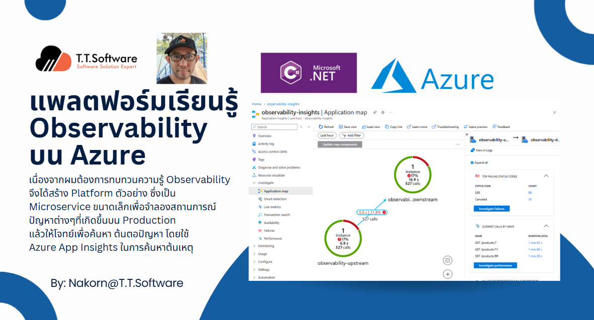
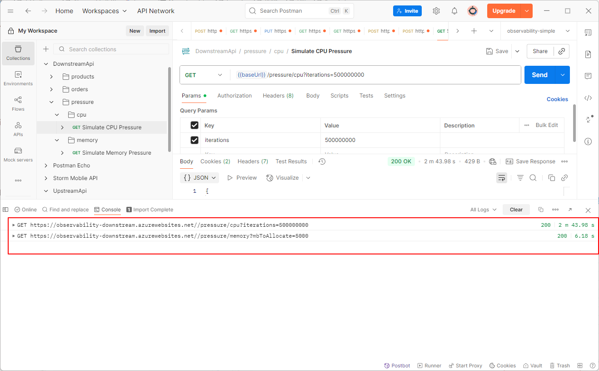
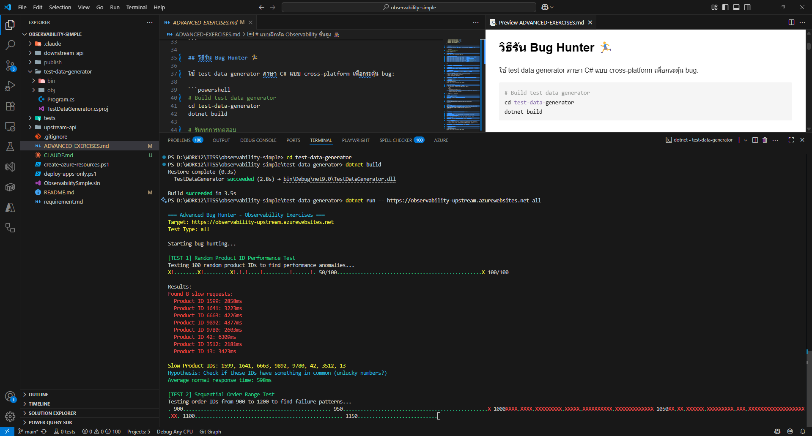
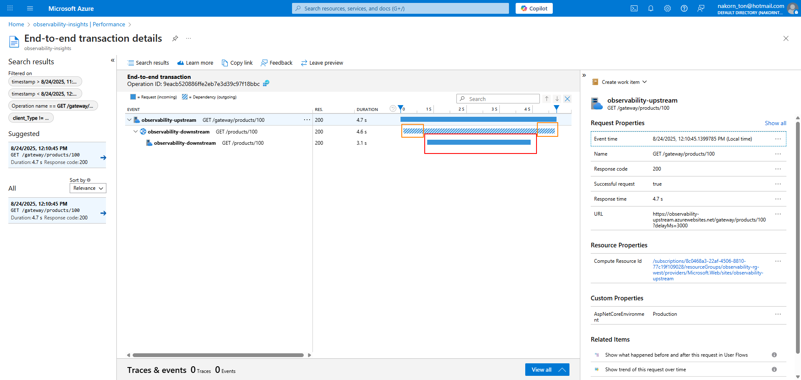
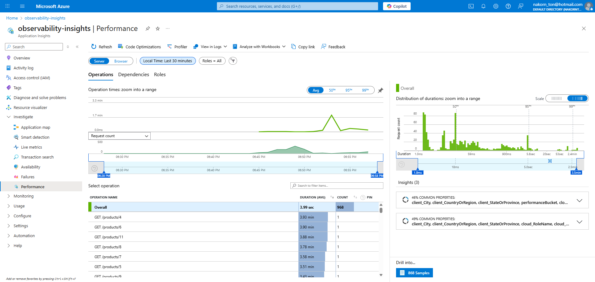
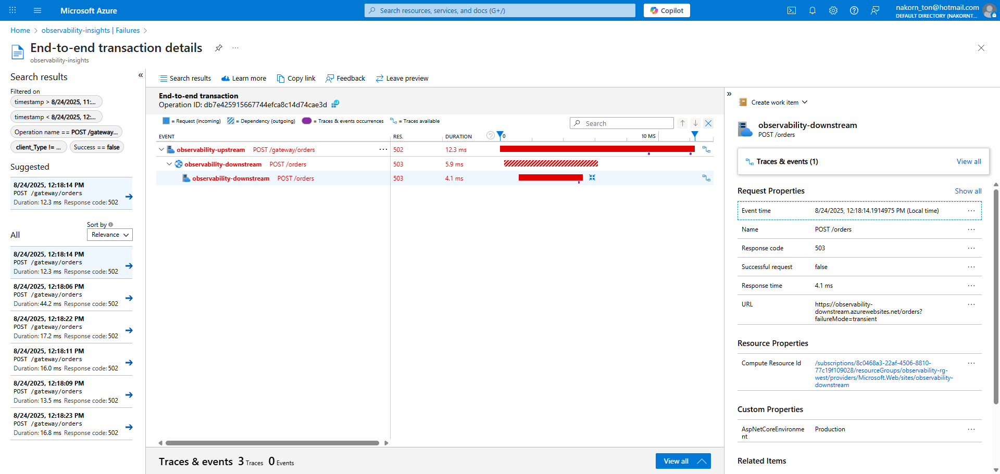
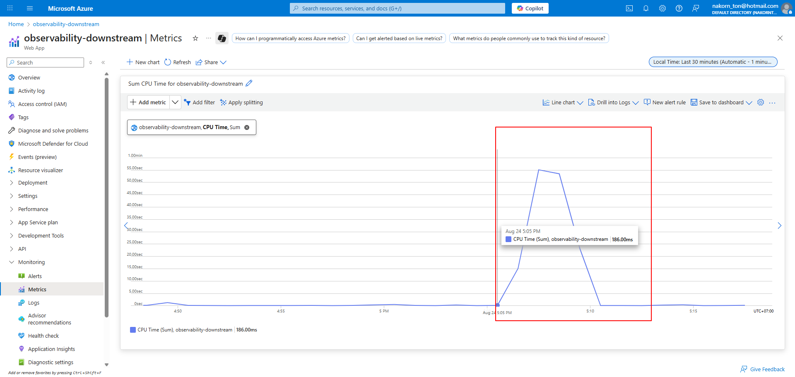
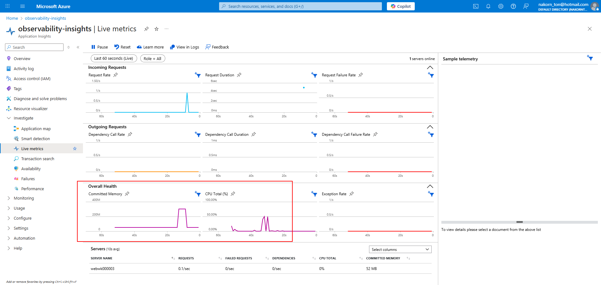

# แพลตฟอร์มเรียนรู้ Observability 🔍



ระบบ microservices สุดเจ๋งที่ออกแบบมาเพื่อให้คุณได้เรียนรู้วิธีการทำ observability แบบทันสมัยด้วย Azure Application Insights ครับ! ระบบนี้ประกอบด้วย .NET 8 Web APIs สองตัวที่จะจำลองปัญหา performance ต่างๆ ที่เจอในโลกจริง เพื่อให้คุณได้ฝึกวิเคราะห์และแก้ปัญหาแบบมืออาชีพ

## ภาพรวมระบบ 🚀

แพลตฟอร์มนี้จำลองระบบ distributed พร้อมปัญหา performance ต่างๆ ที่ตั้งใจใส่เข้าไป เพื่อให้นักพัฒนาได้เรียนรู้:
- **Latency Analysis**: หาว่า service ไหนทำให้ระบบช้าในสาย distributed call
- **Root Cause Analysis**: ตามรอย error จาก API หน้าบ้านไปยัง service หลังบ้าน
- **Resource Monitoring**: ดูผลกระทบของการใช้ CPU และ memory แบบ real-time
- **Distributed Tracing**: เชื่อมโยง request ข้ามขอบเขตของ service ต่างๆ

## สถาปัตยกรรม 🏗️

```
┌─────────────┐         ┌─────────────┐         ┌──────────────────┐
│   Client    │ ──────> │ Upstream API│ ──────> │ Downstream API   │
│  (ลูกค้า)    │         │  (Port 5000)│         │   (Port 5001)    │
└─────────────┘         └─────────────┘         └──────────────────┘
                               │                          │
                               └──────────┬───────────────┘
                                          │
                                 ┌────────▼────────┐
                                 │ Azure Application│
                                 │    Insights      │
                                 └─────────────────┘
```

## สิ่งที่ต้องเตรียม 📋

### สำหรับ Local Development
- [.NET 8 SDK](https://dotnet.microsoft.com/download/dotnet/8.0) - ติดตั้งให้เรียบร้อยนะครับ
- Visual Studio 2022 หรือ VS Code (ถ้าชอบ)

### สำหรับ Azure Deployment
- Azure subscription (ต้องมีนะ ไม่งั้นเล่นไม่ได้)
- [Azure CLI](https://docs.microsoft.com/en-us/cli/azure/install-azure-cli) ติดตั้งซะ
- Azure Application Insights resource
- Azure App Service หรือ Azure Container Apps

## เริ่มใช้งานด่วน ⚡

1. **Clone repository มาก่อน**
   ```powershell
   git clone <repository-url>
   cd observability-simple
   ```

2. **Build solution ซะหน่อย**
   ```powershell
   dotnet build
   ```

3. **ตั้งค่า Azure** (สำหรับ deploy ขึ้น Azure)
   
   ตรวจสอบว่าติดตั้ง Azure CLI แล้ว และ login เข้าระบบ:
   ```powershell
   # เช็คว่าติดตั้ง Azure CLI หรือยัง
   az --version
   
   # ถ้ายังไม่ติดตั้ง ไปโหลดมาจาก: https://aka.ms/installazurecliwindows
   
   # Login เข้า Azure
   az login
   ```
   
   มันจะเปิด browser ให้ใส่รหัสผ่าน พอ login สำเร็จแล้ว:
   ```powershell
   # เช็คดูว่า login ได้จริงไหม และดู subscription
   az account show
   
   # ถ้ามีหลาย subscription ก็ list ดูหน่อย
   az account list --output table
   
   # เลือก subscription ที่จะใช้ (ถ้าต้องการ)
   az account set --subscription "ชื่อหรือ-id-subscription-ของคุณ"
   ```

4. **Deploy ขึ้น Azure** (แนะนำวิธีนี้เลย!)
   
   ใช้ PowerShell script รันง่ายๆ:
   ```powershell
   # สร้าง Azure resources ทั้งหมด (ทำครั้งเดียว)
   .\create-azure-resources.ps1
   
   # Deploy แอพพลิเคชั่น
   .\deploy-apps-only.ps1
   ```
   
   Script จะจัดการ Application Insights และการตั้งค่าทั้งหมดให้อัตโนมัติเลย!
   
   อัพเดท `appsettings.json` ของทั้งสอง API:
   ```json
   "ApplicationInsights": {
     "ConnectionString": "InstrumentationKey=KEY_ของคุณ;IngestionEndpoint=https://eastus-8.in.applicationinsights.azure.com/;LiveEndpoint=https://eastus.livediagnostics.monitor.azure.com/"
   }
   ```

5. **รันใน Local** (ถ้าไม่อยาก deploy)
   
   รันทั้งสอง API พร้อมกัน:
   ```powershell
   # เปิด PowerShell หน้าต่างแรก - รัน downstream API
   cd downstream-api/DownstreamApi
   dotnet run
   # API จะรันที่ http://localhost:5001
   
   # เปิด PowerShell หน้าต่างที่สอง - รัน upstream API
   cd upstream-api/UpstreamApi  
   dotnet run
   # API จะรันที่ http://localhost:5000
   ```

6. **เข้าดู Swagger UI ได้เลย**
   - Local Downstream API: http://localhost:5001/swagger
   - Local Upstream API: http://localhost:5000/swagger
   - Azure Upstream API: https://app-ของคุณ.azurewebsites.net/swagger

## API Endpoints ที่มีให้เล่น 🎮

### Downstream API (Port 5001)

| Endpoint | Method | คำอธิบาย | Parameters |
|----------|--------|----------|------------|
| `/products/{id}` | GET | ดึงข้อมูลสินค้า พร้อมความช้าที่ปรับได้ | `id` (path), `delayMs` (query, ไม่บังคับ) |
| `/orders` | POST | สร้างคำสั่งซื้อ พร้อมจำลองความล้มเหลว | `failureMode` (query: none/transient/persistent) |
| `/pressure/cpu` | GET | จำลองการทำงานหนักของ CPU | `iterations` (query, ไม่บังคับ) |
| `/pressure/memory` | GET | จำลองการใช้ memory | `mbToAllocate` (query, ไม่บังคับ) |

### Upstream API (Port 5000)

| Endpoint | Method | คำอธิบาย | Parameters |
|----------|--------|----------|------------|
| `/gateway/products/{id}` | GET | Gateway ไปยัง downstream products | `id` (path), `delayMs` (query, ไม่บังคับ) |
| `/gateway/orders` | POST | Gateway ไปยัง downstream orders | `failureMode` (query, ไม่บังคับ) |

## สถานการณ์ทดสอบ 🧪

### 1. จำลองความช้า (Latency Simulation)
ทดสอบ response time ที่ช้า:
```powershell
# Response ปกติ
Invoke-RestMethod http://localhost:5001/products/123

# ช้า 2 วินาที
Invoke-RestMethod "http://localhost:5001/products/123?delayMs=2000"

# ผ่าน gateway พร้อมความช้า
Invoke-RestMethod "http://localhost:5000/gateway/products/456?delayMs=1500"
```

### 2. จำลองข้อผิดพลาด (Error Simulation)
ทดสอบ failure modes ต่างๆ:
```powershell
# สถานการณ์สำเร็จ
Invoke-RestMethod -Uri http://localhost:5001/orders -Method Post

# ความล้มเหลวชั่วคราว (โอกาส 50%)
Invoke-RestMethod -Uri "http://localhost:5001/orders?failureMode=transient" -Method Post

# ล้มเหลวตลอด (100% พัง)
Invoke-RestMethod -Uri "http://localhost:5001/orders?failureMode=persistent" -Method Post

# ผ่าน gateway
Invoke-RestMethod -Uri "http://localhost:5000/gateway/orders?failureMode=transient" -Method Post
```

### 3. กดดัน CPU
จำลองการใช้ CPU สูง:
```powershell
# โหลดเบาๆ
Invoke-RestMethod "http://localhost:5001/pressure/cpu?iterations=100000"

# โหลดหนักมาก
Invoke-RestMethod "http://localhost:5001/pressure/cpu?iterations=10000000"
```

### 4. กดดัน Memory
จำลองการจอง memory:
```powershell
# จอง 50MB
Invoke-RestMethod "http://localhost:5001/pressure/memory?mbToAllocate=50"

# จอง 200MB
Invoke-RestMethod "http://localhost:5001/pressure/memory?mbToAllocate=200"
```


*ตัวอย่างการใช้ Postman เรียก API เพื่อทดสอบการใช้งาน CPU และ Memory*

## ฟีเจอร์ Observability 📊

### Structured Logging
ทุก endpoint ใช้ structured logging พร้อม key-value pairs:
- Product operations log: `ProductId`, `DelayMs`
- Order operations log: `FailureMode`, `OrderId`
- CPU pressure logs: `Iterations`, `Duration`
- Memory pressure logs: `MbToAllocate`

### Distributed Tracing
ระบบรองรับ distributed tracing ผ่าน:
- การส่งต่อ correlation ID อัตโนมัติระหว่าง Upstream และ Downstream APIs
- ติดตาม request ข้ามขอบเขต service
- เชื่อมโยง error จาก gateway ไปยัง backend services

### การรวมกับ Application Insights
เมื่อตั้งค่า Azure Application Insights แล้ว คุณสามารถ:
- ดูรายละเอียด transaction แบบ end-to-end
- วิเคราะห์ performance metrics และหา bottlenecks
- ตั้ง alerts สำหรับความล้มเหลวและ performance ที่แย่ลง
- สร้าง custom dashboards สำหรับ monitoring

## แบบฝึกหัดการเรียนรู้ 📚

### แบบฝึกหัดพื้นฐาน

#### แบบฝึกหัด 1: หาต้นตอความช้า
1. เรียก `/gateway/products/100?delayMs=3000`
2. ใช้ Application Insights หาว่าความช้าเกิดที่ไหน
3. ยืนยันว่าความช้าอยู่ใน downstream service

#### แบบฝึกหัด 2: ตามรอยความล้มเหลวชั่วคราว
1. เรียก `/gateway/orders?failureMode=transient` หลายๆ ครั้ง
2. สังเกตอัตราความล้มเหลว 50%
3. ตามรอย request ที่ล้มเหลวผ่านทั้งสอง service
4. ระบุจุดที่ล้มเหลวและรายละเอียด error

#### แบบฝึกหัด 3: Monitor การใช้ทรัพยากร
1. สร้างแรงดัน CPU: `/pressure/cpu?iterations=50000000`
2. สร้างแรงดัน memory: `/pressure/memory?mbToAllocate=500`
3. ดูผลกระทบต่อ performance ของ service
4. ตั้ง alerts สำหรับการใช้ทรัพยากรสูง

#### แบบฝึกหัด 4: เชื่อมโยง Distributed Errors
1. หยุด Downstream API
2. เรียก gateway endpoints
3. สังเกต 502 Bad Gateway errors
4. ตามรอยความสัมพันธ์ระหว่าง gateway errors และ downstream ที่ไม่พร้อมใช้งาน

### แบบฝึกหัดขั้นสูง 🔍

**[ดูแบบฝึกหัด Observability ขั้นสูง](./ADVANCED-EXERCISES.md)**

แบบฝึกหัดขั้นสูงมี bug แบบ production จริงๆ ที่ซ่อนอยู่ ต้องใช้ทักษะนักสืบหาให้เจอ:
- **ปริศนาสินค้าช้าลึกลับ** - บางสินค้าโหลดช้ามาก 3+ วินาทีเลย!
- **ความผิดปกติการประมวลผลคำสั่งซื้อ** - คำสั่งซื้อบางช่วงล้มเหลว 90%
- **ปริศนา Memory Leak** - บาง request ทำให้ memory ไม่ถูกคืน
- **ปัญหา Performance เป็นรอบ** - ทุกๆ สอง-สาม request จะค้างไป 5 วินาที
- **หายนะ Cache เสียหาย** - input ผิดๆ ทำให้ response หลังจากนั้นพังหมด
- **อาการ CPU พุ่งสูง** - ID แบบ palindrome ทำให้ CPU พุ่งสุดๆ

ใช้ test data generator แบบ cross-platform เพื่อกระตุ้น bug:
```powershell
# Build test data generator
cd test-data-generator
dotnet build

# รันทุกการทดสอบ
dotnet run -- http://localhost:5000 all

# รันเฉพาะประเภท (random, range, prime, load, palindrome, edge)
dotnet run -- http://localhost:5000 palindrome
```


*Console application สำหรับสร้าง test data เพื่อทดสอบ advanced exercises*

## การตั้งค่า ⚙️

### Application Settings
ทั้งสอง API ตั้งค่าผ่าน `appsettings.json`:

**Downstream API:**
```json
{
  "ApplicationInsights": {
    "ConnectionString": "CONNECTION_STRING_ของคุณ"
  },
  "Kestrel": {
    "Endpoints": {
      "Http": {
        "Url": "http://localhost:5001"
      }
    }
  }
}
```

**Upstream API:**
```json
{
  "ApplicationInsights": {
    "ConnectionString": "CONNECTION_STRING_ของคุณ"
  },
  "DownstreamApi": {
    "BaseUrl": "http://localhost:5001"
  },
  "Kestrel": {
    "Endpoints": {
      "Http": {
        "Url": "http://localhost:5000"
      }
    }
  }
}
```

## แก้ปัญหาเบื้องต้น 🔧

### APIs ไม่ยอม start
- ตรวจสอบว่า port 5000 และ 5001 ไม่มีใครใช้อยู่
- เช็คว่าติดตั้ง .NET 8 SDK แล้ว: `dotnet --version`

### Connection refused ระหว่าง services
- ต้องรัน Downstream API ก่อนทดสอบ Upstream API
- ตรวจสอบ `DownstreamApi:BaseUrl` ใน Upstream API configuration

### ไม่เห็น telemetry ใน Application Insights
- ตรวจสอบว่า connection string ถูกต้อง
- เช็คว่า Application Insights resource ยังใช้งานอยู่
- รอสักสองสามนาทีให้ telemetry ขึ้นมา

## โครงสร้าง Project 📁

```
observability-simple/
├── downstream-api/
│   └── DownstreamApi/
│       ├── Program.cs          # Endpoints และ configuration ทั้งหมด
│       ├── appsettings.json    # Configuration
│       └── DownstreamApi.csproj
├── upstream-api/
│   └── UpstreamApi/
│       ├── Program.cs          # Gateway endpoints
│       ├── appsettings.json    # Configuration
│       └── UpstreamApi.csproj
├── test-data-generator/
│   ├── Program.cs              # Test data generator แบบ cross-platform
│   └── TestDataGenerator.csproj
├── tests/
│   ├── ObservabilityTests/    # Shared test utilities
│   └── DownstreamApiTests/    # Downstream API unit tests
├── create-azure-resources.ps1  # Script สร้าง Azure resources
├── deploy-apps-only.ps1        # Script deploy applications
├── ObservabilitySimple.sln     # Solution file
├── CLAUDE.md                   # แผนการ implementation
├── README.md                   # ไฟล์ต้นฉบับภาษาอังกฤษ
├── README_TH.md                # ไฟล์นี้ (ภาษาไทย)
├── ADVANCED-EXERCISES.md       # แบบฝึกหัดล่า bug ขั้นสูง
└── ADVANCED-EXERCISES_TH.md    # แบบฝึกหัดขั้นสูงภาษาไทย
```

## การ Deploy ขึ้น Azure ☁️

### PowerShell Deployment Scripts

**ขั้นตอนที่ 1: สร้าง Azure Resources (ทำครั้งเดียว)**
สร้าง Azure resources ที่จำเป็นทั้งหมด:

```powershell
# สร้าง Azure resources ทั้งหมด (Resource Group, App Service Plan, Web Apps, Application Insights)
.\create-azure-resources.ps1

# หรือใช้ parameters ที่กำหนดเอง
.\create-azure-resources.ps1 -ResourceGroup "my-rg" -Location "eastus" -DownstreamAppName "my-downstream" -UpstreamAppName "my-upstream"
```

**ขั้นตอนที่ 2: Deploy Applications (สำหรับอัพเดท)**
Deploy code ล่าสุดไปยัง Azure resources ที่มีอยู่:

```powershell
# Deploy apps ไปยัง resources ที่มีอยู่
.\deploy-apps-only.ps1

# หรือใช้ parameters ที่กำหนดเอง
.\deploy-apps-only.ps1 -ResourceGroup "observability-rg-west" -DownstreamApp "observability-downstream" -UpstreamApp "observability-upstream"
```

**Workflow ทั้งหมด:**
```powershell
# 1. สร้าง resources (ครั้งเดียว)
.\create-azure-resources.ps1

# 2. Deploy applications
.\deploy-apps-only.ps1

# 3. ทดสอบกับ bug ขั้นสูง
cd test-data-generator
dotnet run -- https://observability-upstream.azurewebsites.net all
```

### การ Deploy Azure App Service แบบ Manual

ถ้าอยาก deploy เองแบบ manual ทำตาม PowerShell steps นี้:

#### สิ่งที่ต้องมี
- Azure CLI ติดตั้งและ login แล้ว (`az login`)
- PowerShell 5.1 หรือ PowerShell Core 7+
- สิทธิ์ Azure subscription ที่เหมาะสม

#### ขั้นตอนการ Deploy ทีละขั้น

1. **สร้าง Resource Group และ Application Insights**
   ```powershell
   # เลือก region ที่ subscription คุณรองรับ
   # ตัวเลือกทั่วไป: westus2, eastus2, centralus, westeurope
   az group create --name observability-rg-west --location westus2
   
   # สร้าง Application Insights
   az monitor app-insights component create `
     --app observability-insights `
     --location westus2 `
     --resource-group observability-rg-west `
     --application-type web
   ```

2. **สร้าง App Service Plan**
   ```powershell
   # ลอง F1 (Free) tier ก่อน ถ้าไม่ได้ค่อยใช้ B1
   az appservice plan create `
     --name observability-plan `
     --resource-group observability-rg-west `
     --location westus2 `
     --sku F1
   
   # ถ้า F1 ไม่พอ (quota เต็ม) ลองใช้ B1 (ต้องมี compute quota)
   # az appservice plan create `
   #   --name observability-plan `
   #   --resource-group observability-rg-west `
   #   --location westus2 `
   #   --sku B1
   ```

3. **สร้าง Web Apps**
   ```powershell
   # สร้าง downstream API app
   az webapp create `
     --name observability-downstream `
     --resource-group observability-rg-west `
     --plan observability-plan `
     --runtime "dotnet:8"
   
   # สร้าง upstream API app
   az webapp create `
     --name observability-upstream `
     --resource-group observability-rg-west `
     --plan observability-plan `
     --runtime "dotnet:8"
   ```

4. **ตั้งค่า Application Settings**
   ```powershell
   # ดึง Application Insights connection string
   $connectionString = az monitor app-insights component show `
     --app observability-insights `
     --resource-group observability-rg-west `
     --query connectionString -o tsv
   
   # ตั้งค่า Downstream API
   az webapp config appsettings set `
     --name observability-downstream `
     --resource-group observability-rg-west `
     --settings "APPLICATIONINSIGHTS_CONNECTION_STRING=$connectionString"
   
   # ตั้งค่า Upstream API พร้อม downstream URL
   az webapp config appsettings set `
     --name observability-upstream `
     --resource-group observability-rg-west `
     --settings "APPLICATIONINSIGHTS_CONNECTION_STRING=$connectionString" `
                "DownstreamApi__BaseUrl=https://observability-downstream.azurewebsites.net"
   ```

5. **Build และ Deploy Applications**
   ```powershell
   # Build downstream API
   dotnet publish downstream-api/DownstreamApi/DownstreamApi.csproj `
     --configuration Release `
     --output ./publish/downstream
   
   # Build upstream API  
   dotnet publish upstream-api/UpstreamApi/UpstreamApi.csproj `
     --configuration Release `
     --output ./publish/upstream
   
   # สร้าง deployment packages
   Compress-Archive -Path 'publish/downstream/*' -DestinationPath 'publish/downstream-api.zip' -Force
   Compress-Archive -Path 'publish/upstream/*' -DestinationPath 'publish/upstream-api.zip' -Force
   
   # Deploy ขึ้น Azure
   az webapp deploy `
     --name observability-downstream `
     --resource-group observability-rg-west `
     --src-path publish/downstream-api.zip `
     --type zip
   
   az webapp deploy `
     --name observability-upstream `
     --resource-group observability-rg-west `
     --src-path publish/upstream-api.zip `
     --type zip
   ```

6. **ตรวจสอบการ Deploy**
   ```powershell
   # ทดสอบ health endpoints
   Invoke-RestMethod https://observability-downstream.azurewebsites.net/health
   Invoke-RestMethod https://observability-upstream.azurewebsites.net/health
   
   # ทดสอบ application endpoints
   Invoke-RestMethod "https://observability-upstream.azurewebsites.net/gateway/products/123?delayMs=100"
   
   # เข้าดู Swagger UI
   # ไปที่: https://observability-upstream.azurewebsites.net/swagger
   ```

### ทดสอบ Azure Deployment

หลังจาก deploy ขึ้น Azure แล้ว ลองทดสอบ endpoints:

```powershell
# Health checks
Invoke-RestMethod https://your-downstream-app.azurewebsites.net/health
Invoke-RestMethod https://your-upstream-app.azurewebsites.net/health

# Product endpoint พร้อมจำลองความช้า
Invoke-RestMethod "https://your-upstream-app.azurewebsites.net/gateway/products/123?delayMs=500"

# Order endpoint พร้อมจำลองความล้มเหลว
Invoke-RestMethod -Uri "https://your-upstream-app.azurewebsites.net/gateway/orders?failureMode=transient" -Method Post

# ทดสอบแรงดัน CPU
Invoke-RestMethod "https://your-downstream-app.azurewebsites.net/pressure/cpu?iterations=100000"

# ทดสอบแรงดัน memory
Invoke-RestMethod "https://your-downstream-app.azurewebsites.net/pressure/memory?mbToAllocate=50"

# ทดสอบ bug ขั้นสูง (ถ้าเปิดใช้งาน)
cd test-data-generator
dotnet run -- https://your-upstream-app.azurewebsites.net all
```

## Monitoring ใน Azure 📈

### ตัวอย่างผลลัพธ์ใน Azure Application Insights

#### Transaction ที่ช้า

*ตัวอย่างการแสดง transaction ที่มีความช้าใน Azure Application Insights*


*การแสดง transaction ที่ช้าหลายรายการพร้อมกัน*

#### การตรวจจับความล้มเหลว

*ตัวอย่างการแสดง failed transactions จากการเรียก API*

#### การ Monitor CPU และ Memory

*กราฟแสดง CPU spike ใน Azure Monitor*


*Live monitoring แสดง CPU และ Memory usage แบบ real-time*

### Application Insights Queries

เข้า Application Insights ใน Azure Portal แล้วลอง KQL queries เหล่านี้:

1. **ดู Request ทั้งหมด**
   ```kusto
   requests
   | where timestamp > ago(1h)
   | summarize count() by name, resultCode
   | order by count_ desc
   ```

2. **ตามรอย Request Flow**
   ```kusto
   requests
   | where name contains "gateway"
   | join kind=inner (dependencies | where name contains "products" or name contains "orders") on operation_Id
   | project timestamp, request_name = name, dependency_name = name1, duration, resultCode
   ```

3. **วิเคราะห์ Performance**
   ```kusto
   requests
   | where timestamp > ago(1h)
   | summarize avg(duration), max(duration), min(duration) by name
   | order by avg_duration desc
   ```

4. **วิเคราะห์ Error**
   ```kusto
   requests
   | where success == false
   | summarize count() by name, resultCode, problemId
   | order by count_ desc
   ```

### การตั้ง Alerts

1. **สร้าง Alert สำหรับ Error Rate สูง**
   ```powershell
   az monitor metrics alert create `
     --name "High Error Rate" `
     --resource-group observability-rg-west `
     --scopes /subscriptions/{subscription-id}/resourceGroups/observability-rg-west/providers/Microsoft.Insights/components/observability-insights `
     --condition "count requests/failed > 10" `
     --window-size 5m `
     --evaluation-frequency 1m
   ```

2. **สร้าง Alert สำหรับ Response Time สูง**
   ```powershell
   az monitor metrics alert create `
     --name "High Response Time" `
     --resource-group observability-rg-west `
     --scopes /subscriptions/{subscription-id}/resourceGroups/observability-rg-west/providers/Microsoft.Insights/components/observability-insights `
     --condition "avg requests/duration > 2000" `
     --window-size 5m `
     --evaluation-frequency 1m
   ```

## การจัดการค่าใช้จ่าย 💰

- **App Service**: B1 tier ประมาณ $13/เดือน  
- **Application Insights**: 5GB แรกฟรี หลังจากนั้น $2.30/GB

วิธีประหยัดค่าใช้จ่าย:
1. ใช้ F1 (Free) หรือ B1 App Service tier สำหรับการเรียนรู้
2. ลบ resources เมื่อไม่ใช้: `az group delete --name observability-rg-west`
3. คอย monitor การใช้ข้อมูลใน Application Insights

## ขั้นตอนต่อไป 🎯

1. **Deploy ขึ้น Azure** ด้วยวิธีใดวิธีหนึ่งข้างบน
2. **รัน load tests** กับ Azure endpoints เพื่อสร้าง telemetry
3. **สร้าง custom dashboards** ใน Application Insights
4. **ตั้ง alerts** สำหรับเงื่อนไขความล้มเหลวต่างๆ
5. **ฝึกตอบสนอง incident** ด้วย Azure monitoring tools
6. **สำรวจ Log Analytics** สำหรับ query ขั้นสูง

## License 📄

นี่คือแพลตฟอร์มการเรียนรู้เพื่อการศึกษาครับ!